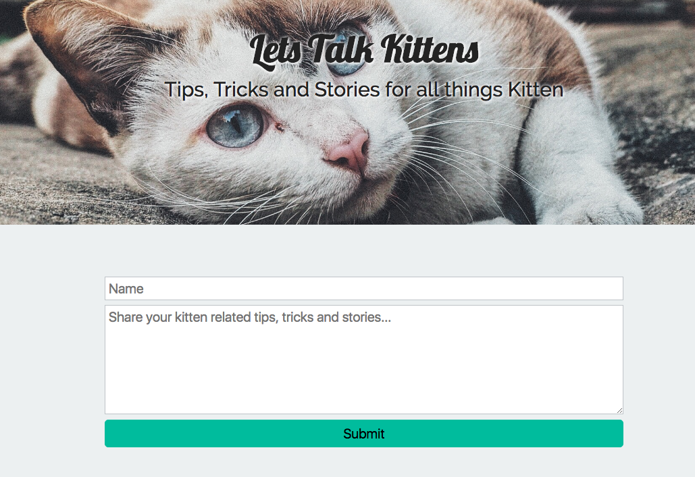

# Let's Talk Kitten message board

Simple app using a MERN stack to create a messaging board for cat lovers.

Sketch:

Dependencies for project:
* `npm install body-parser`
* `npm install express`
* `npm install mongoose`
* `npm install express validator`
* `npm install foreman`
* `npm install nodemon`
* `npm install axios`

How to Start:

- `git clone https://github.com/bbryant7/MERN-simple-app.git`
- `cd MERN-simple-app`
- `npm install`
- `npm run start-dev`
